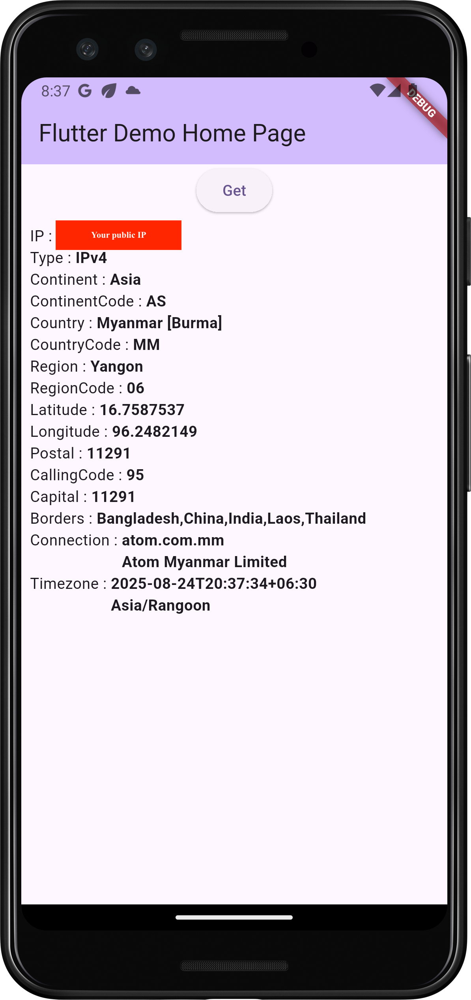

<!--
This README describes the package. If you publish this package to pub.dev,
this README's contents appear on the landing page for your package.

For information about how to write a good package README, see the guide for
[writing package pages](https://dart.dev/tools/pub/writing-package-pages).

For general information about developing packages, see the Dart guide for
[creating packages](https://dart.dev/guides/libraries/create-packages)
and the Flutter guide for
[developing packages and plugins](https://flutter.dev/to/develop-packages).
-->

## Features
THis package is to get the public IP of the current network.

This `ip_geo_lookup` package totally supporst for `iOS`, `Android` , `Web`, `Linux` and `MacOS`.  

## Getting started

THis package need the Internet.

## Usage

### Android
Add `INTERNET` permission in `AndroidManifest.xml`
```Java
<uses-permission android:name="android.permission.INTERNET"/>
```

To get data, use `IPGeoLookupUtility` directly. It will return `IPInfo` with list.
In `CountryData`, the following fields will include ..  
```dart
   String? ip;
   bool? success;
   String? type;
   String? continent;
   String? continentCode;
   String? country;
   String? countryCode;
   String? region;
   String? regionCode;
   String? city;
   double? latitude;
   double? longitude;
   bool? isEu;
   String? postal;
   String? callingCode;
   String? capital;
   List<String>? borders;
   Flag? flag;
   Connection? connection;
   Timezone? timezone;
```

## DEMO
 


